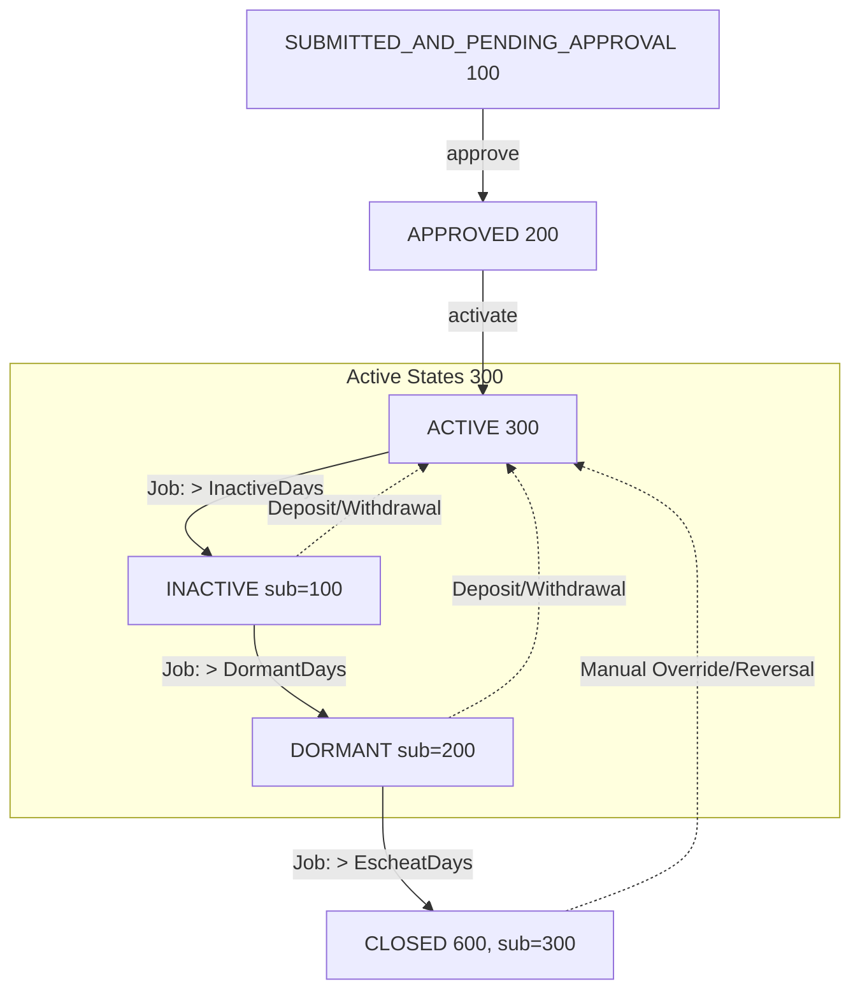

# Fineract Deep Dive: Savings Lifecycle, Interest Engine & Business Date

---

## 1. Business Date

### What It Is

Fineract maintains two distinct "dates" separate from wall-clock time. These are stored in the **`m_business_date`** table.

| Type | Enum | Description |
|---|---|---|
| `BUSINESS_DATE` | id=1 | The "today" used for all API operations and transaction dating |
| `COB_DATE` | id=2 | The date through which Close-of-Business processing has completed |

**Key invariant:** `COB_DATE = BUSINESS_DATE − 1 day` (when COB auto-adjustment is enabled)

### Why Two Dates?

- **`BUSINESS_DATE`** = what date is it for the **human user** (teller, loan officer)? All new transactions are dated using this.
- **`COB_DATE`** = the last date that batch EOD processing (COB) has *finished* running against. It tells you "all accounts are fully processed and settled through this date."

This separation allows the system to roll the business date forward (morning open) while COB is still running for the previous day.

### How It Is Resolved at Runtime

The `ThreadLocalContextUtil` / `FineractContext` carries the business date in a `HashMap<BusinessDateType, LocalDate>`. Every API request thread gets the current `BUSINESS_DATE` injected. COB batch jobs run under `ActionContext.COB` which resolves dates from `COB_DATE`.

```
ActionContext.DEFAULT  →  uses BusinessDateType.BUSINESS_DATE
ActionContext.COB      →  uses BusinessDateType.COB_DATE
```

`DateUtils.getBusinessLocalDate()` is the single method the whole codebase calls to get "today".

### Enabling Business Date

Business Date is a **feature flag** — it must be explicitly enabled in global configuration:

```
c_configuration: enable-business-date = true
```

If not enabled, all date logic falls back to `LocalDate.now()` of the tenant's timezone.

### The Two Auto-Advance Jobs

| Job Name | Enum | What it does |
|---|---|---|
| `Increase Business Date by 1 day` | `INCREASE_BUSINESS_DATE_BY_1_DAY` | Advances `BUSINESS_DATE` by +1 |
| `Increase COB Date by 1 day` | `INCREASE_COB_DATE_BY_1_DAY` | Advances `COB_DATE` by +1 |

Both are Spring Batch **Tasklets**. The `Increase Business Date` tasklet also automatically sets `COB_DATE = BUSINESS_DATE - 1` when the `is-cob-date-adjustment-enabled` global config flag is true.

```
POST /v1/businessdate
{
  "type": "BUSINESS_DATE",
  "date": "2025-01-15",
  "dateFormat": "yyyy-MM-dd",
  "locale": "en"
}
```

```
GET /v1/businessdate            → all dates
GET /v1/businessdate/BUSINESS_DATE
GET /v1/businessdate/COB_DATE
```

### Date Relationship Diagram

```
  Jan 10          Jan 11          Jan 12
    │               │               │
    ▼               ▼               ▼
 COB_DATE     (COB running)   BUSINESS_DATE
 "Fully        "Still in         "Human
  settled"      progress"         today"
```

---

## 2. Savings Account Lifecycle

### Account States

```
SUBMITTED_AND_PENDING_APPROVAL (100)
         │
         ▼  [approve]
      APPROVED (200)
         │
         ▼  [activate]
       ACTIVE (300)  ◄─────────────┐
         │                         │
         ▼  [long inactivity]       │ [reactivate]
    Sub-statuses:                  │
      INACTIVE (300, sub=100)       │
      DORMANT  (300, sub=200)      │
      ESCHEAT  (300, sub=300) ─────┘ (manual override)
         │
         ▼  [close]
      CLOSED (600)
```

**Also possible from SUBMITTED:** REJECTED (400) or WITHDRAWN (500)

### Key Lifecycle Dates Stored on `m_savings_account`

| Column | Meaning |
|---|---|
| `submittedon_date` | Application received |
| `approvedon_date` | Maker-checker approval |
| `activatedon_date` | Account opened for transactions |
| `closedon_date` | Account closed |
| `start_interest_calculation_date` | Override start for interest (if different from activation) |
| `accrued_till_date` | Tracks last accrual run date |
| `last_closed_business_date` | Last COB date processed for this account |

### API Operations: The Savings Lifecycle

Fineract drives the entire savings account lifecycle through a core set of REST APIs. Here is a detailed breakdown of when to use each operation and the key fields to include in your JSON payloads.

#### 1. Submit Application
`POST /v1/savingsaccounts`
*   **When to use:** When a client first requests a new savings account. This creates the account in a `Submitted and Pending Approval` state (Status 100). No financial transactions can occur yet.
*   **Key Fields:**
    *   `clientId`: ID of the customer.
    *   `productId`: ID of the underlying Savings Product.
    *   `submittedOnDate`: Date the application was received.
    *   `externalId`: Your external Core Banking / UUID reference.
    *   *Note: You can override product defaults here (like `nominalAnnualInterestRate`) if the product configuration allows it.*

#### 2. Approve Application
`POST /v1/savingsaccounts/{id}?command=approve`
*   **When to use:** When the back-office or branch manager verifies KYC/documentation and approves the application. Moves account to `Approved` state (Status 200).
*   **Key Fields:**
    *   `approvedOnDate`: Must be >= `submittedOnDate`.
    *   `note`: Optional justification for approval.

#### 3. Activate Account
`POST /v1/savingsaccounts/{id}?command=activate`
*   **When to use:** To formally open the account for business. Moves account to `Active` state (Status 300). This step is critical because it triggers the deduction of any **Activation Fees** and enforces the **Minimum Opening Balance**.
*   **Key Fields:**
    *   `activatedOnDate`: Must be >= `approvedOnDate`.

#### 4. Deposit Funds
`POST /v1/savingsaccounts/{id}/transactions?command=deposit`
*   **When to use:** To credit funds to the savings account.
*   **Key Fields:**
    *   `transactionDate`: The backdated or current date of the deposit.
    *   `transactionAmount`: The monetary value.
    *   `paymentTypeId`: Enum linking to Cash, Cheque, Wire Transfer, etc.
    *   *(Optional)* `accountNumber`, `routingCode`, `receiptNumber` for auditing payment details.

#### 5. Withdraw Funds
`POST /v1/savingsaccounts/{id}/transactions?command=withdrawal`
*   **When to use:** To debit funds from the account. This endpoint automatically evaluates Overdraft limits, Minimum Required Balances, Lock-in periods, and triggers any mapped **Withdrawal Fees**.
*   **Key Fields:**
    *   `transactionDate`: Date of withdrawal.
    *   `transactionAmount`: Value to withdraw.
    *   `paymentTypeId`: Method of payout.

#### 6. Calculate Interest (On-Demand)
`POST /v1/savingsaccounts/{id}?command=calculateInterest`
*   **When to use:** To force the system to calculate interest accrued up to today and update the account `Summary` totals in memory. **Crucially, this does NOT post a physical transaction to the account balance.** It is purely used to get an up-to-date figure for reporting, statements, or UI displays before the end-of-month batch job runs.
*   **Key Fields:** None required. Empty JSON `{}`.

#### 7. Post Interest (On-Demand)
`POST /v1/savingsaccounts/{id}?command=postInterest`
*   **When to use:** To force the system to physically generate an `Interest Posting` transaction and credit the customer's `runningBalance` **now**, bypassing the scheduled posting period (e.g., doing it mid-month instead of waiting for month-end).
*   **Key Fields:** None required. Empty JSON `{}`.

#### 8. Close Account
`POST /v1/savingsaccounts/{id}?command=close`
*   **When to use:** When the client requests account closure. This is a terminal state (Status 600) that stops all future interest accrual and fee deductions.
*   **Key Fields:**
    *   `closedOnDate`: Date of closure.
    *   `withdrawBalance`: `true` automatically generates a final withdrawal transaction to bring the balance to 0.
    *   `postInterestValidationOnClosure`: `true` ensures final uncredited interest is posted right before closure.

#### 9. Block Account
`POST /v1/savingsaccounts/{id}?command=block`
*   **When to use:** To completely freeze the account (blocking both deposits and withdrawals) due to compliance investigations, fraud alerts, or legal mandates.
*   **Key Fields:**
    *   `reasonForBlock`: Mandotory free text  explaining the freeze for audit trails. Better for frontend to enforce a list of reasons to choose from.

#### 10. Unblock Account
`POST /v1/savingsaccounts/{id}?command=unblock`
*   **When to use:** To remove the freeze and restore normal transaction capabilities once an investigation concludes.
*   **Key Fields:** None required. Empty JSON `{}`.

---

## 3. Savings Interest Engine — Deep Dive

### 3.1 The Four Configuration Parameters (Set on Product / Account)

| Parameter | API Field | Values |
|---|---|---|
| **Annual Interest Rate** | `nominalAnnualInterestRate` | e.g., `5.0` (percent) |
| **Interest Compounding Period** | `interestCompoundingPeriodType` | Daily=1, Monthly=4, Quarterly=5, Semi-annual=6, Annual=7 |
| **Interest Posting Period** | `interestPostingPeriodType` | Monthly=4, Quarterly=5, Semi-annual=6, Annual=7 |
| **Calculation Type** | `interestCalculationType` | **Daily Balance=1**, **Average Daily Balance=2** |
| **Days in Year** | `interestCalculationDaysInYearType` | 360=360, 365=365 |

### 3.2 Daily Balance vs Average Daily Balance

#### Daily Balance (interestCalculationType = 1)
Interest accrues on the **end-of-day balance** for each individual day within the compounding period.

```
Interest_day_n = EOD_Balance_day_n × (annualRate / daysInYear)

Monthly Interest = Σ Interest_day_n  (for all n in period)
```

**Example:**
- Balance Jan 1–10: 10,000
- Balance Jan 11–31: 15,000
- Rate: 12% p.a., 365-day year

```
Jan 1–10:  10,000 × (0.12/365) × 10 = 32.88
Jan 11–31: 15,000 × (0.12/365) × 21 = 103.56
Total interest for January = 136.44
```

#### Average Daily Balance (interestCalculationType = 2)
Interest is calculated on the **average** of end-of-day balances across the posting period.

```
ADB = Σ(EOD_Balance_day_n) / daysInPeriod

Monthly Interest = ADB × (annualRate / daysInYear) × daysInPeriod
```

**Example (same data):**
```
ADB = (10,000×10 + 15,000×21) / 31 = (100,000 + 315,000) / 31 = 13,387.10

Interest = 13,387.10 × (0.12/365) × 31 = 136.44
```

> **Note:** Mathematically identical totals in simple scenarios. Differences emerge when there are multiple intra-period transactions and compounding interactions.

### 3.3 How the Engine Executes (Code Walk)

The entire interest pipeline lives in two key paths:

**Path A — Legacy (JPA Entity-based):** `SavingsAccount.postInterest()` → `calculateInterestUsing()` → `PostingPeriod.createFrom()`

**Path B — New (DTO-based, used by the batch job):** `SavingsAccountInterestPostingService.postInterest()` → `calculateInterestUsing()` → `PostingPeriod.createFromDTO()`

Both paths follow this algorithm:

```
Step 1: recalculateDailyBalances()
  ↓  Walks all transactions in date order.
     For each tx: runningBalance += credit OR runningBalance -= debit
     Assigns: balance_held_for_n_days (endOfBalanceDate)

Step 2: determineInterestPostingPeriods()
  ↓  Generates list of LocalDateIntervals based on postingPeriodType
     e.g., Monthly → [Jan 1–Jan 31], [Feb 1–Feb 28], ...

Step 3: For each PostingPeriod interval:
  ↓  PostingPeriod.createFrom(interval, transactions, interestCalculationType, ...)
     └─ Internally calls CompoundingPeriod.createFrom() for each compounding period
        └─ EndOfDayBalance.cumulativeBalance()  ← this is where DB vs ADB branches

Step 4: savingsHelper.calculateInterestForAllPostingPeriods()
  ↓  Applies lock-in period: interest = 0 if still within lockin

Step 5: postInterest() creates SavingsAccountTransaction of type INTEREST_POSTING
  ↓  Also creates WITHHOLDING_TAX transaction if withHoldTax is enabled
```

### 3.4 Key Internal Classes

| Class | Role |
|---|---|
| `PostingPeriod` | Represents one interest posting period (e.g., Jan). Holds all compounding sub-periods and the computed earned interest |
| `SavingsHelper` | Utility: determines posting period intervals, fetches existing interest post transaction IDs |
| `SavingsAccountTransactionSummaryWrapper` | Recalculates summary totals (totalDeposits, totalWithdrawals, totalInterest) |
| `SavingsAccountSummary` | Embedded summary entity on `m_savings_account` — caches running totals |

### 3.5 Minimum Balance for Interest Calculation

If `minBalanceForInterestCalculation` is set on the product, any day where EOD balance < minimum is treated as **zero balance** for interest purposes. The interest for that day = 0.

### 3.6 Withholding Tax on Interest

When `withHoldTax = true` AND deposit type = SAVINGS_DEPOSIT, after posting the interest transaction, a second transaction of type `WITHHOLD_TAX` is immediately created and debited from the account. It is split per `TaxComponent` mapping in the linked `TaxGroup`.

---

## 4. Savings-Related Batch Jobs

### Overview of All Savings Jobs

| Job Name (display) | `JobName` Enum | Tasklet | What It Does |
|---|---|---|---|
| `Post Interest For Savings` | `POST_INTEREST_FOR_SAVINGS` | `PostInterestForSavingTasklet` | Calculates and posts interest for ALL active savings accounts |
| `Apply Annual Fee For Savings` | `APPLY_ANNUAL_FEE_FOR_SAVINGS` | `ApplyAnnualFeeForSavingsTasklet` | Applies annual charges that are due |
| `Pay Due Savings Charges` | `PAY_DUE_SAVINGS_CHARGES` | `PayDueSavingsChargesTasklet` | Deducts charges due today |
| `Update Savings Dormant Accounts` | `UPDATE_SAVINGS_DORMANT_ACCOUNTS` | `UpdateSavingsDormantAccountsTasklet` | Transitions ACTIVE → INACTIVE → DORMANT → ESCHEAT based on inactivity |
| `Update Deposit Accounts Maturity details` | `UPDATE_DEPOSITS_ACCOUNT_MATURITY_DETAILS` | `UpdateDepositsAccountMaturityDetailsTasklet` | Closes/matures Fixed Deposit / Recurring Deposit accounts |
| `Transfer Interest To Savings` | `TRANSFER_INTEREST_TO_SAVINGS` | `TransferInterestToSavingsTasklet` | Moves accrued FD/RD interest to linked savings account |
| `Generate Mandatory Savings Schedule` | `GENERATE_RD_SCEHDULE` | `GenerateRdScheduleTasklet` | Generates installment schedule for Recurring Deposits |
| `Add Accrual Transactions For Savings` | `ADD_PERIODIC_ACCRUAL_ENTRIES_FOR_SAVINGS_WITH_INCOME_POSTED_AS_TRANSACTIONS` | `AddAccrualTransactionForSavingsTasklet` | Accrual-basis accounting entries |
| `Increase Business Date by 1 day` | `INCREASE_BUSINESS_DATE_BY_1_DAY` | `IncreaseBusinessDateBy1DayTasklet` | Rolls BUSINESS_DATE forward |
| `Increase COB Date by 1 day` | `INCREASE_COB_DATE_BY_1_DAY` | `IncreaseCobDateBy1DayTasklet` | Rolls COB_DATE forward |

### Focus: `Post Interest For Savings` (The Critical Job)

**Default Cron:** `0 0 0 1/1 * ? *` (midnight every day)

**Internal flow:**
1. Reads all ACTIVE savings accounts in **paginated batches** (configurable `batch-size` and `thread-pool-size` job parameters)
2. Splits the page into sub-lists — one per thread in the pool
3. Each thread runs `SavingsSchedularInterestPosterTask` (a `Callable<Void>`)
4. While threads process the current page, a "fetch-ahead" callable pre-loads the next page into a queue
5. Each `SavingsSchedularInterestPosterTask` calls `SavingsAccountInterestPostingService.postInterest()` per account
6. If interest was actually posted, a `SavingsPostInterestBusinessEvent` is fired

**Key configuration flag:** `backdatedTxnsAllowedTill` (global setting `pivot-date-config`)
- `false` = classic mode: interest calculated from account opening, all transactions in memory
- `true` = pivot-date mode: only transactions since last close date processed, opening balance from `runningBalanceOnPivotDate`

### Focus: `Update Savings Dormant Accounts`

Uses `DateUtils.getBusinessLocalDate()` (not wall clock) to evaluate inactivity thresholds. Sub-status transitions:

```
ACTIVE (sub=0)
  → INACTIVE (sub=100)   when last_active_date < businessDate - inactiveDays
  → DORMANT  (sub=200)   when last_active_date < businessDate - dormantDays
  → ESCHEAT  (sub=300)   when last_active_date < businessDate - escheatDays
```

---

## 5. Setup → Verify → Execute → Observe (Practical Walkthrough)

### SETUP

#### 1. Enable Business Date

> **Important:** `m_business_date` is empty after installation — it has **no rows** until you call `POST /v1/businessdate` for the first time. The Liquibase migration only creates the table structure, not any data.
> While the table is empty (or the feature is disabled), Fineract silently falls back to `LocalDate.now(tenantTimezone)` for all date operations.

**Step 1a — Enable the feature flag**

The config name in the DB is **`enable-business-date`** (hyphen).

Option A — directly via SQL (simplest for initial setup):
```sql
UPDATE c_configuration SET enabled = true WHERE name = 'enable-business-date';
```

Option B — via API (look up the ID first):
```
-- Find the ID
GET /v1/configurations

-- From the response, find the entry where "name": "enable-business-date" and note its id, then:
PUT /v1/configurations/{id}
{ "enabled": true }
```

Verify it is enabled:
```sql
SELECT id, name, enabled FROM c_configuration WHERE name = 'enable-business-date';
-- enabled should be 1 (true)
```

**Step 1b — Confirm COB auto-adjustment is enabled** (it is by default, but verify):
```sql
SELECT name, enabled FROM c_configuration
WHERE name IN ('enable-business-date', 'enable-automatic-cob-date-adjustment');
```
Both should be `enabled = 1`. If `enable-automatic-cob-date-adjustment` is off, COB_DATE will not auto-follow BUSINESS_DATE.

#### 2. Seed the Initial Business Date (creates rows in m_business_date)

This is the **first and only** API call that inserts into `m_business_date`. Set it to your intended operational start date.

```
POST /v1/businessdate
{
  "type": "BUSINESS_DATE",
  "date": "2025-01-01",
  "dateFormat": "yyyy-MM-dd",
  "locale": "en"
}
```

Because `enable_automatic_cob_date_adjustment` is enabled, this single call inserts **two rows**:
- `BUSINESS_DATE = 2025-01-01`
- `COB_DATE = 2024-12-31`  ← automatically set to BUSINESS_DATE − 1

Verify the rows were created:
```sql
SELECT type, date FROM m_business_date;
-- Expected:
-- BUSINESS_DATE | 2025-01-01
-- COB_DATE      | 2024-12-31
```

#### 3. Create Savings Product with Interest Parameters

```json
POST /v1/savingsproducts
{
  "name": "Standard Savings",
  "shortName": "SS01",
  "currencyCode": "KES",
  "digitsAfterDecimal": 2,
  "nominalAnnualInterestRate": 5.0,
  "interestCompoundingPeriodType": 1,       // Daily compounding
  "interestPostingPeriodType": 4,           // Post monthly
  "interestCalculationType": 1,             // Daily Balance
  "interestCalculationDaysInYearType": 365,
  "accountingRule": 2                       // ACCRUAL_PERIODIC
}
```

#### 4. Open, Approve, Activate Savings Account

```
POST /v1/savingsaccounts          → { "savingsId": 42 }
POST /v1/savingsaccounts/42?command=approve
POST /v1/savingsaccounts/42?command=activate  { "activatedOnDate": "2025-01-01" }
```

### VERIFY

Check account is correctly configured:
```
GET /v1/savingsaccounts/42
```

Confirm in response:
- `status.value = "active"`
- `interestCalculationType.id = 1` (Daily Balance)
- `interestPostingPeriodType.id = 4` (Monthly)
- `nominalAnnualInterestRate = 5.0`

Make a deposit so there's a balance to earn interest on:
```
POST /v1/savingsaccounts/42/transactions?command=deposit
{ "transactionDate": "2025-01-01", "transactionAmount": 100000, ... }
```

### EXECUTE

#### Manual (on-demand) interest posting:

```
POST /v1/savingsaccounts/42?command=calculateInterest
POST /v1/savingsaccounts/42?command=postInterest
```

#### Via Job (all accounts):

```
POST /v1/jobs/{jobId}?command=executeJob
```
where `{jobId}` is the ID of "Post Interest For Savings" (typically id=6 in sample data).

#### Advance the date and run again:

```
POST /v1/businessdate  { "type": "BUSINESS_DATE", "date": "2025-02-01" }
POST /v1/jobs/{jobId}?command=executeJob   ← runs posting for Jan period
```

### OBSERVE

#### Check that interest was posted:

```
GET /v1/savingsaccounts/42/transactions
```

Look for `transactionType.value = "Interest Posting"` transactions.

#### Verify the math (Daily Balance example):

```
Account Balance Jan 1–31: 100,000 KES
Rate: 5% p.a., 365-day year
Daily interest rate: 5% / 365 = 0.01369863%

Daily interest: 100,000 × 0.0001369863 = 13.70 KES/day
January interest (31 days): 13.70 × 31 = 424.66 KES
```

Confirm `GET /v1/savingsaccounts/42` shows:
- `summary.totalInterestPosted: 424.66`
- `summary.accountBalance: 100424.66`

---

## 6. Daily Balance vs Average Daily Balance — Side-by-Side

| Aspect | Daily Balance (id=1) | Average Daily Balance (id=2) |
|---|---|---|
| **Calculation basis** | Each day's EOD balance independently | Average of all EOD balances in period |
| **Mid-month deposit effect** | Deposit immediately earns on full amount | Deposit averaged across remaining days |
| **Withdrawal effect** | Immediately stops earning on withdrawn amount | Spread over the period |
| **Favourable to customer when** | Depositing early in period | Depositing late in period (higher average) |
| **API value** | `"interestCalculationType": 1` | `"interestCalculationType": 2` |
| **Code path** | `PostingPeriod` → sum of per-day interest | `PostingPeriod` → sum EOD balances / days |
| **Typical use** | Standard current/savings accounts | Money market, call deposit accounts |

---

## 7. Key Database Tables

| Table | Purpose |
|---|---|
| `m_business_date` | Stores BUSINESS_DATE and COB_DATE |
| `m_savings_account` | Account entity, status, interest config fields |
| `m_savings_account_transaction` | All financial transactions (deposits, withdrawals, interest postings, charges) |
| `m_savings_product` | Product templates with default interest params |
| `job` / `qrtz_*` | Quartz scheduler job definitions and state |
| `c_configuration` | Global config flags including `enable-business-date` |

---

## 8. Common Gotchas

> [!WARNING]
> **Business Date must be enabled** before it takes effect. Without it, all date comparisons use `LocalDate.now(tenantTimezone)` — so scheduled jobs will post interest based on wall-clock time, not the controlled business date.

> [!IMPORTANT]
> **COB_DATE must always be < BUSINESS_DATE.** If they are equal, COB jobs may conflict with API operations that read/write accounts. The auto-adjustment flag keeps this invariant automatically.

> [!NOTE]
> The `Post Interest For Savings` job calculates interest from account activation (or `startInterestCalculationDate`) **every time it runs**. It is idempotent — if an interest posting transaction for a given period already exists with the correct amount, no new transaction is created. It only creates/corrects if the amount changed.

> [!CAUTION]
> **Posting Period vs Compounding Period**: Interest is **compounded** at the compounding period frequency, but only **posted** (credited to the account) at the posting period frequency. Posting period must be >= compounding period. Setting daily compounding + monthly posting means interest compounds daily but the customer only sees a credit monthly.

---

## 9. Holidays & Working Days

Fineract has two separate but related systems for managing non-working time: **Working Days** (recurring weekly schedule) and **Holidays** (specific named dates). They serve the same purpose as T24's holiday calendar but are architecturally distinct.

---

### 9.1 Working Days (`m_working_days`)

Defines which **days of the week** are operational, stored as an **iCalendar RRULE recurrence string** — the same RFC 5545 format used by Google Calendar and Outlook.

#### RRULE Format

```
FREQ=WEEKLY;INTERVAL=1;BYDAY=<comma-separated days>
```

| Day Code | Day |
|---|---|
| `MO` | Monday |
| `TU` | Tuesday |
| `WE` | Wednesday |
| `TH` | Thursday |
| `FR` | Friday |
| `SA` | Saturday |
| `SU` | Sunday |

#### Common Examples

| Schedule | RRULE |
|---|---|
| Monday–Friday (standard) | `FREQ=WEEKLY;INTERVAL=1;BYDAY=MO,TU,WE,TH,FR` |
| Monday–Saturday (6-day week) | `FREQ=WEEKLY;INTERVAL=1;BYDAY=MO,TU,WE,TH,FR,SA` |
| All 7 days | `FREQ=WEEKLY;INTERVAL=1;BYDAY=MO,TU,WE,TH,FR,SA,SU` |

#### How It Is Evaluated

`WorkingDaysUtil.isWorkingDay()` checks any given date against the RRULE:

```java
// Internally: CalendarUtils.isValidRecurringDate(rrule, date, date)
// Returns true if the date falls on a day listed in BYDAY
```

For `BYDAY=MO,TU,WE,TH,FR`:
- Thursday 30 Apr 2026 → ✅ working day
- Friday 01 May 2026 → ✅ working day (but may also be a holiday — separate check)
- Saturday 02 May 2026 → ❌ non-working day
- Sunday 03 May 2026 → ❌ non-working day

#### Non-Working Day Repayment Rescheduling Options

| `repaymentRescheduleType` | Behaviour |
|---|---|
| `1` (SAME_DAY) | Process on the non-working day anyway |
| `2` (MOVE_TO_NEXT_WORKING_DAY) | Shift forward to next working day |
| `3` (MOVE_TO_NEXT_REPAYMENT_MEETING_DAY) | Shift to next meeting date |
| `4` (MOVE_TO_PREVIOUS_WORKING_DAY) | Shift back to previous working day |

#### API

```
GET /v1/workingdays

PUT /v1/workingdays
{
  "recurrence": "FREQ=WEEKLY;INTERVAL=1;BYDAY=MO,TU,WE,TH,FR",
  "repaymentRescheduleType": 2,
  "locale": "en"
}
```

---

### 9.2 Holidays (`m_holiday`)

Defines **specific named date ranges** as non-working, scoped **per Office** (branch).

#### Key Fields

| Field | Purpose |
|---|---|
| `name` | e.g., "Labour Day 2026" |
| `fromDate` / `toDate` | The holiday date range |
| `repaymentsRescheduledTo` | Specific date to move repayments to |
| `reschedulingType` | `1` = next repayment date, `2` = specific date |
| `officeId` | Scoped per branch/office |
| `status` | `PENDING_FOR_ACTIVATION` → `ACTIVE` |

Holidays require a **two-step activation** before they take effect:

```
Step 1 — Create (status = PENDING):
POST /v1/holidays
{
  "name": "Labour Day 2026",
  "fromDate": "01 May 2026",
  "toDate": "01 May 2026",
  "repaymentsRescheduledTo": "04 May 2026",
  "locale": "en",
  "dateFormat": "dd MMMM yyyy",
  "offices": [{ "officeId": 1 }],
  "reschedulingType": 2
}

Step 2 — Activate (status = ACTIVE):
POST /v1/holidays/{holidayId}?command=activate
```

Other operations:
```
GET    /v1/holidays?officeId=1    → list holidays for an office
GET    /v1/holidays/{id}          → single holiday
PUT    /v1/holidays/{id}          → update (name/description only once active)
DELETE /v1/holidays/{id}          → soft delete (status = DELETED)
```

---

### 9.3 Global Configuration Flags

Three flags control system behaviour on holidays and non-working days. **All three default to `false` after installation.**

```sql
SELECT name, enabled FROM c_configuration WHERE name IN (
  'reschedule-repayments-on-holidays',
  'allow-transactions-on-holiday',
  'allow-transactions-on-non-workingday'
);
```

> [!NOTE]
> The third flag is `allow-transactions-on-non-workingday` — "workingday" is one word with no hyphen. Confirmed in `GlobalConfigurationConstants.java` line 28.

| Config Name | Default | Effect when `true` |
|---|---|---|
| `reschedule-repayments-on-holidays` | `false` | Loan repayments on active holidays move to `repaymentsRescheduledTo` |
| `allow-transactions-on-holiday` | `false` | Tellers can post transactions on holiday dates |
| `allow-transactions-on-non-workingday` | `false` | Tellers can post transactions on weekends/non-working days |

#### What All-False Means (Default State)

| Scenario | Result |
|---|---|
| Teller posts deposit **on a holiday** | ❌ Blocked — API rejects the transaction |
| Teller posts deposit **on a weekend** | ❌ Blocked — API rejects the transaction |
| Loan repayment falls **on a holiday** | ❌ Not rescheduled — treated as missed/overdue |

#### Recommended Setup for Standard Banking Operation

```sql
UPDATE c_configuration SET enabled = true WHERE name = 'reschedule-repayments-on-holidays';
UPDATE c_configuration SET enabled = true WHERE name = 'allow-transactions-on-non-workingday';
UPDATE c_configuration SET enabled = true WHERE name = 'allow-transactions-on-holiday';
```

---

### 9.4 Critical Gap vs T24: Business Date is NOT Holiday-Aware

> [!WARNING]
> **`Increase Business Date by 1 day`** always does a plain `+1` with no holiday or weekend check:
> ```java
> businessDate = businessDate.plusDays(1);  // no holiday/weekend awareness
> ```
> `BusinessDateWritePlatformServiceImpl` has zero reference to `WorkingDaysUtil` or the holiday repository.

**T24 scenario** — COB on Thu 30-Apr, skip Fri 01-May (holiday) + Sat + Sun → BUSINESS_DATE becomes Mon 04-May — **does not happen automatically in Fineract**.

#### Options to Achieve T24-Like Behaviour

| Option | Approach |
|---|---|
| **Manual / external scheduler** | Don't activate the auto-advance job. Drive `POST /v1/businessdate` from an external calendar-aware scheduler that knows your holiday table |
| **Custom Tasklet** | Extend `IncreaseBusinessDateBy1DayTasklet` to loop through `WorkingDaysUtil.isNonWorkingDay()` and `HolidayRepositoryWrapper` checks, advancing until a valid business day is reached |

---

### 9.5 Impact on Savings Interest

Holidays and working days **do not affect interest calculation**. The savings interest engine calculates based on actual EOD balance for every calendar day regardless of whether that day was a weekend or holiday. These flags only gate **human-initiated transaction submission**.

---

### 9.6 Non-Working Days vs Holidays — Full Comparison

A holiday is not simply a "named non-working day". There are **five meaningful differences**:

| Aspect | Non-Working Days | Holidays |
|---|---|---|
| **Pattern** | Recurring forever (every Sat & Sun, always) | Specific one-off named date ranges |
| **Scope** | **System-wide** — applies to all offices | **Per Office/Branch** — different branches can have different holidays |
| **Activation** | Always active once configured via `PUT /v1/workingdays` | Must go through `PENDING → ACTIVE` two-step before it has any effect |
| **Reschedule target** | Dynamically calculated (next/previous working day per RRULE) | You specify an **explicit target date** (`repaymentsRescheduledTo`) |
| **Config flag** | `allow-transactions-on-non-workingday` | `allow-transactions-on-holiday` |

#### The Separate Config Flags Enable Fine-Grained Control

Because they have separate flags, you can mix and match independently:

**Scenario A — Saturday banking allowed, but public holidays strictly blocked:**
```sql
UPDATE c_configuration SET enabled = true  WHERE name = 'allow-transactions-on-non-workingday';
UPDATE c_configuration SET enabled = false WHERE name = 'allow-transactions-on-holiday';
```

**Scenario B — Strict institution — no weekend or holiday transactions:**
```sql
UPDATE c_configuration SET enabled = false WHERE name = 'allow-transactions-on-non-workingday';
UPDATE c_configuration SET enabled = false WHERE name = 'allow-transactions-on-holiday';
```

**Scenario C — 24/7 digital bank — everything allowed, just reschedule loan repayments:**
```sql
UPDATE c_configuration SET enabled = true WHERE name = 'allow-transactions-on-non-workingday';
UPDATE c_configuration SET enabled = true WHERE name = 'allow-transactions-on-holiday';
UPDATE c_configuration SET enabled = true WHERE name = 'reschedule-repayments-on-holidays';
```

#### Office Scoping for Holidays

A bank with branches in different regions can configure holidays independently per office:
- Head Office: 01 May (Labour Day) is a holiday
- Branch A: same + a regional public holiday specific to that county

Each `POST /v1/holidays` call takes an `offices` array, so holiday rules are **branch-aware**. Working days, by contrast, are one global RRULE for the entire organization.

---

### 9.7 Feature Summary

| Feature | Working Days | Holidays | Config Flag Required |
|---|---|---|---|
| Loan repayment rescheduling | ✅ (to next/prev working day) | ✅ (to explicit target date) | `reschedule-repayments-on-holidays` |
| Block/allow teller transactions | ✅ | ✅ | `allow-transactions-on-non-workingday` / `allow-transactions-on-holiday` |
| Office-level scoping | ❌ System-wide only | ✅ Per office/branch | N/A |
| Requires activation workflow | ❌ | ✅ PENDING → ACTIVE | N/A |
| Business Date auto-advance skipping | ❌ Not built-in | ❌ Not built-in | Requires custom implementation |
| Savings interest calculation | ❌ Not affected | ❌ Not affected | N/A — calculates on all calendar days |

---

## 10. Advanced Product Features & Operational Workflows

Fineract's savings module supports an extensive array of advanced capabilities ranging from tiered interest to automated tax withholding. This section deeply explores how to set up, verify, and execute these features.

### 10.1 Day Count Conventions (360 vs 365)

The "Days In Year" convention determines the denominator used when calculating daily interest from an annual rate.

> [!NOTE]
> Unlike the Loan module which supports `Actual/Actual` and `30/360`, the Savings module natively supports only **360** and **365** days in a year.

#### Setup & Execute
When creating a Savings Product (`POST /v1/savingsproducts`), pass `interestCalculationDaysInYearType`:
*   `360` = 360 Days
*   `365` = 365 Days

```json
{
  "name": "High Yield Savings",
  "shortName": "HYS",
  "interestCalculationDaysInYearType": 360,
  "nominalAnnualInterestRate": 5.0,
  ...
}
```

#### Observe
*   If `365`: A 5% annual rate yields a daily rate of `0.05 / 365 = 0.00013698`
*   If `360`: A 5% annual rate yields a daily rate of `0.05 / 360 = 0.00013888` (resulting in slightly higher daily interest for the client).

---

### 10.2 Minimum Opening Balance

Enforces that a new account cannot be activated unless it is funded with a minimum initial deposit.

#### Setup
Set `minRequiredOpeningBalance` during product creation (`POST /v1/savingsproducts`):

```json
{
  "minRequiredOpeningBalance": 500.00
}
```

#### Execute & Verify
When submitting a new savings account application (`POST /v1/savingsaccounts`), Fineract checks this limit. 
However, the actual enforcement happens during **Activation**. If the client has no funds to transfer, or you try to activate an account without the minimum balance deposited via a linked initial transaction, the system throws:

```json
{
  "developerMessage": "Savings account activation requires a minimum opening balance of 500.00",
  "defaultUserMessage": "Minimum opening balance requirement not met."
}
```

#### Observe
To successfully activate, you must either pass the initial deposit in the activation payload, or deposit the funds first (if the state allows) and then activate.

---

### 10.3 Minimum Balance to Earn Interest

A threshold below which the account accrues **zero interest** for that day, regardless of the interest rate.

#### Setup
Set `minBalanceForInterestCalculation` on the product:

```json
{
  "minBalanceForInterestCalculation": 1000.00
}
```

#### Execute & Observe
If an account's end-of-day balance is `$999.00`, the `Post Interest For Savings` job evaluates:
1.  Is EOD balance >= `minBalanceForInterestCalculation`?
2.  If `false`, daily interest = 0.
3.  If `true`, daily interest = Balance * Daily Rate.

This acts as a powerful incentive for clients to maintain liquidity in their accounts.

---

### 10.4 Overdraft Support

Allows accounts to hold a negative balance up to a specified limit, acting as a short-term credit facility.

#### Setup
Three key parameters control this on the Savings Product (`POST /v1/savingsproducts`):

```json
{
  "allowOverdraft": true,
  "overdraftLimit": 5000.00,
  "nominalAnnualInterestRateOverdraft": 18.0,
  "minOverdraftForInterestCalculation": 0.00
}
```

#### Execute
When a client with $100 withdraws $600 (`POST /v1/savingsaccounts/{id}/transactions?command=withdrawal`):
1.  The transaction succeeds.
2.  The account `runningBalance` becomes `-500.00`.

#### Observe
During the `Post Interest For Savings` batch job, the engine checks the balance sign:
*   If `balance > 0`: Uses the standard `nominalAnnualInterestRate`.
*   If `balance < 0`: Uses `nominalAnnualInterestRateOverdraft` (18% in the example). The accrued interest is booked as an **Overdraft Interest Charge** against the account, further decreasing the negative balance.

---

### 10.5 Lock-in Periods

Prevents any withdrawals for a specified duration after the account is activated (or after initial deposit).

#### Setup
Define the frequency and duration on the product:

```json
{
  "lockinPeriodFrequency": 6, //defines the actual number of those units in lockinPeriodFrequencyType
  "lockinPeriodFrequencyType": 2   //uses enum values to define the unit of measurement for the time period as: 0=Days, 1=Weeks, 2=Months, 3=Years
}
```
*(Example: 6 Months lock-in)*

#### Execute & Verify
If the account was activated on `2026-01-01`, the lock-in expires on `2026-07-01`.
Attempting a withdrawal on `2026-05-01`:

```
POST /v1/savingsaccounts/1/transactions?command=withdrawal
{ "transactionDate": "01 May 2026", "transactionAmount": 100.00 }
```

**Observation (Error):**
The API immediately rejects the transaction:
```json
{
  "defaultUserMessage": "Withdrawal is not allowed before lock-in period ends on 01 July 2026",
  "errorIndicator": "error.msg.savingsaccount.transaction.withdrawals.blocked.during.lockin"
}
```

---

### 10.6 Withdrawal Limits (Fees & Caps)

Governs how often or how much a client can withdraw, and what penalties apply.

> [!WARNING]
> **Native Limitation:** Fineract natively supports a boolean `withdrawalFeeForTransfers` to apply penalties, and a single `withdrawalFeeAmount` (via a Charge). However, it does **not natively support hard caps on the number of withdrawals per month/day** out of the box. Such caps are typically implemented by extending the `SavingsAccountWritePlatformService` or by using custom DataTables and external API Gateway interceptors.

#### Setup (Withdrawal Fees)
Create a Charge (`POST /v1/charges`):
```json
{
  "name": "Withdrawal Fee",
  "chargeAppliesTo": 2,          // Savings
  "chargeTimeType": 7,           // Withdrawal Fee
  "chargeCalculationType": 1,    // Flat
  "amount": 10.00,
  ...
}
```

Link it to the Savings Product (`POST /v1/savingsproducts`):
```json
{
  "charges": [{"id": 1}],
  "withdrawalFeeForTransfers": true
}
```

#### Observe
Every time a withdrawal or an outward transfer is made, the engine automatically deducts the `10.00` fee from the account balance in the same transaction context.

---

### 10.7 Activation Fee

A one-time fee automatically deducted when the account transitions from `Submitted/Approved` to `Active`.

#### Setup
Create an Activation Charge (`POST /v1/charges`):
```json
{
  "name": "Account Opening Fee",
  "chargeAppliesTo": 2,          // Savings
  "chargeTimeType": 1,           // Specified Due Date / Activation
  "chargeCalculationType": 1,    // Flat
  "amount": 25.00,
  ...
}
```

#### Execute
1.  Link the charge to the Savings Product.
2.  Approve a savings account application.
3.  Activate the account (`POST /v1/savingsaccounts/{id}?command=activate`).

#### Observe
Upon activation, the system immediately generates a transaction to deduct the `25.00` fee. If the account's initial deposit isn't large enough to cover the fee (and `allowOverdraft` is false), the activation will fail.

---

### 10.8 Annual/Monthly Fees

Recurring maintenance fees automatically applied at set intervals.

#### Setup
Create the Charge (`POST /v1/charges`):
```json
{
  "name": "Monthly Maintenance Fee",
  "chargeAppliesTo": 2,          // Savings
  "chargeTimeType": 6,           // Monthly Fee (5 for Annual)
  "chargeCalculationType": 1,
  "amount": 5.00,
  "feeOnMonthDay": "01 January", // Base calculation day
  "feeInterval": 1               // Every 1 month
}
```

#### Execute
This relies on a specific background job.

```sql
-- Ensure the job is active
SELECT job_identifier, is_active FROM job WHERE job_identifier = 'Apply Annual Fee For Savings';
```

#### Observe
When the `Apply Annual Fee For Savings` job runs, it evaluates the `feeOnMonthDay` and `feeInterval` relative to the current Business Date. If due, it posts the fee transaction.

---

### 10.9 Inactivity/Dormancy Fees

Accounts automatically shift through states (Inactive → Dormant → Escheat) based on the lack of transaction activity, triggering specific fees.

#### Setup
Configure dormancy on the product (`POST /v1/savingsproducts`):
```json
{
  "isDormancyTrackingActive": true,
  "daysToInactive": 90,
  "daysToDormancy": 180,
  "daysToEscheat": 3650
}
```

Next, create a Dormancy Fee (`POST /v1/charges`):
```json
{
  "name": "Dormancy Penalty",
  "chargeAppliesTo": 2,          // Savings
  "chargeTimeType": 11,          // Savings No Activity Fee
  "chargeCalculationType": 1,
  "amount": 15.00
}
```
Link this charge to the product.

#### Execute
```sql
-- The job responsible for checking last transaction dates and shifting statuses
SELECT job_identifier, is_active FROM job WHERE job_identifier = 'Update Savings Dormancy';
```

#### Observe
When the `Update Savings Dormancy` job runs, it calculates the difference between the `BUSINESS_DATE` and the account's last transaction date.
*   If `diff >= daysToInactive` (e.g., 90), status changes to **Inactive**.
*   If `diff >= daysToDormancy` (e.g., 180), status changes to **Dormant**, and the system automatically posts the `Savings No Activity Fee` transaction.
*   If `diff >= daysToEscheat` (e.g., 3650 / 10 years), the account status changes to **Escheated**.

> [!NOTE]
> **What is Escheatment?** 
> Escheatment is the legal process of handling abandoned accounts. When an account is escheated in Fineract, a system transaction automatically withdraws the remaining balance (reducing the account to $0) and moves the funds to a designated "Escheat Liability" GL account. The account is then effectively closed.

---

### 10.10 Tiered Interest Rates

Allows you to offer different interest rates based on the account balance (e.g., 2% for $0–$1,000, 3% for $1,001+).

#### Setup
This requires an **Interest Rate Chart** (`POST /v1/interestratecharts`).

```json
{
  "name": "High Yield Tiers",
  "fromDate": "01 January 2025",
  "chartSlabs": [
    {
      "amountRangeFrom": 0,
      "amountRangeTo": 1000,
      "annualInterestRate": 2.0
    },
    {
      "amountRangeFrom": 1001,
      "annualInterestRate": 3.0
    }
  ]
}
```

Link the chart to the savings product during creation/update:
```json
{
  "interestRateCharts": [ ... chart object ... ]
}
```

#### Observe
The `Post Interest For Savings` job dynamically calculates the interest for each day by checking the EOD balance against the active Interest Rate Chart slabs, applying the correct rate for that specific day's balance.

---

### 10.11 Hold & Release Amount (Lien)

Places a freeze on a specific portion of the account balance, typically used when the savings account serves as collateral for a loan.

#### Setup
Ensure the product allows liens (`POST /v1/savingsproducts`):
```json
{
  "lienAllowed": true,
  "maxAllowedLienLimit": 10000.00
}
```

#### Execute
Place a hold on an account (`POST /v1/savingsaccounts/{id}/transactions?command=holdAmount`):
```json
{
  "transactionDate": "01 May 2026",
  "transactionAmount": 500.00,
  "locale": "en",
  "dateFormat": "dd MMMM yyyy"
}
```

#### Observe & Verify
The transaction creates a "Hold Amount" record. 
*   **Available Balance** decreases by $500.
*   **On Hold Funds** (`savingsAmountOnHold`) increases by $500.

To release the funds, use the release command (`POST /v1/savingsaccounts/{id}/transactions?command=releaseAmount`).

---

### 10.12 Standing Instructions

Automates recurring transfers between accounts (e.g., automatically transferring $50 from a Savings account to a Loan account every month).

#### Setup & Execute
Create a Standing Instruction (`POST /v1/standinginstructions`):

```json
{
  "name": "Monthly Loan Repayment",
  "fromOfficeId": 1,
  "fromClientId": 123,
  "fromAccountType": 2,          // 2 = Savings
  "fromAccountId": 456,
  "toOfficeId": 1,
  "toClientId": 123,
  "toAccountType": 1,            // 1 = Loan
  "toAccountId": 789,
  "instructionType": 1,          // 1 = Fixed Amount
  "amount": 50.00,
  "recurrenceType": 2,           // 2 = Periodic
  "recurrenceInterval": 1,
  "recurrenceFrequency": 2,      // 2 = Months
  "monthDay": "01",
  "validFrom": "01 January 2026",
  "locale": "en",
  "dateFormat": "dd MMMM yyyy"
}
```

#### Observe
Ensure the background job is running:
```sql
SELECT job_identifier, is_active FROM job WHERE job_identifier = 'Execute Standing Instruction';
```
When this job runs on the specified `monthDay`, it automatically debits the savings account and credits the target loan/savings account.

---

### 10.13 Tax Withholding (WHT)

Automatically calculates and deducts Withholding Tax from interest earned *before* it is posted to the client's balance.

#### Setup
1.  Create a **Tax Component** (`POST /v1/taxes/component`):
    ```json
    {
      "name": "WHT on Interest",
      "percentage": 15.0,
      "creditAccountType": 2,      // Liability account
      "creditAcountId": 12         // WHT Payable GL Account
    }
    ```
2.  Create a **Tax Group** (`POST /v1/taxes/group`) and add the component to it.
3.  Link the Tax Group to the Savings Product (`POST /v1/savingsproducts`):
    ```json
    {
      "withHoldTax": true,
      "taxGroupId": 1
    }
    ```

#### Observe
When the `Post Interest For Savings` job runs:
1.  Calculates gross interest (e.g., $100.00).
2.  Calculates tax based on the Tax Group (e.g., 15% = $15.00).
3.  Posts an `Interest Posting` transaction for $+100.00.
4.  Immediately posts a `Withhold Tax` transaction for $-15.00.
5.  Net effect on the client's account balance: $+85.00.

---

### 10.14 Account Closure

When a client requests to close their account, the balance must be reduced to zero, and the final accrued interest should typically be posted before closing. Fineract provides a dedicated `close` command to handle the final withdrawal and interest posting simultaneously.

#### Setup
There is no special configuration required on the product, but you must ensure that there are no active liens or uncleared holds blocking the withdrawal of the remaining balance.

#### Execute
Submit the close command (`POST /v1/savingsaccounts/{id}?command=close`):

```json
{
  "closedOnDate": "02 May 2026",
  "withdrawBalance": true,
  "postInterestValidationOnClosure": true,
  "note": "Customer requested account closure due to relocation.",
  "locale": "en",
  "dateFormat": "dd MMMM yyyy",
  "paymentTypeId": 1 
}
```

> [!TIP]
> Setting `postInterestValidationOnClosure` to `true` ensures that any interest accrued between the last posting date and the `closedOnDate` is calculated, posted, and included in the final withdrawal amount. If `withdrawBalance` is `true`, the system handles the final payout via the specified `paymentTypeId`.

#### Observe
When the API successfully processes the closure:
1.  **Interest Posting:** The system posts a final `Interest Posting` transaction for the uncredited accrued interest.
2.  **Withdrawal:** The system immediately posts a final `Withdrawal` transaction for the exact remaining balance (including the just-posted interest), reducing the account balance to `$0.00`.
3.  **Status Change:** The account status changes to **Closed** (`status.id = 600`). No further transactions or interest accruals can occur.

---

### 10.15 Minimum Required Balance

Enforces an absolute floor limit on the account. The balance is not allowed to drop below this amount.

#### Setup
Set `minRequiredBalance` and enable `enforceMinRequiredBalance` on the product or account level (`POST /v1/savingsproducts`):

```json
{
  "minRequiredBalance": 50.00,
  "enforceMinRequiredBalance": true
}
```

#### Execute & Verify
If the account balance is `$100.00`, and a client attempts to withdraw `$70.00`:

```json
{
  "transactionDate": "02 May 2026",
  "transactionAmount": 70.00
}
```

#### Observe
The API will reject the transaction outright because the resulting balance (`$30.00`) would be less than the `$50.00` minimum required balance.

```json
{
  "developerMessage": "Insufficient account balance to complete the transaction.",
  "defaultUserMessage": "Insufficient account balance."
}
```

---

### 10.16 Transaction Upper & Lower Limits

Places hard caps on the size of any single transaction (deposit or withdrawal), preventing exceptionally large or small movements without intervention.

#### Setup
Configure limits on the savings product or account:

```json
{
  "transactionLowerLimit": 10.00,
  "transactionUpperLimit": 10000.00
}
```

#### Execute & Verify
A client attempts to deposit `$5.00` or withdraw `$15,000.00` in a single API call.

#### Observe
The transaction is blocked at the validation layer before any accounting occurs. Note that this is purely a **per-transaction** limit. It does not prevent a client from making two `$8,000` withdrawals on the same day. 

---

### 10.17 Interest Calculation Type

Determines exactly how the balance is evaluated during the interest compounding period.

#### Setup
Set `interestCalculationType` on the product:
*   `1` = Daily Balance
*   `2` = Average Daily Balance

```json
{
  "interestCalculationType": 2
}
```

#### Observe
*   **Daily Balance (1):** The engine calculates interest on the exact End of Day (EOD) balance for every single day.
*   **Average Daily Balance (2):** The engine takes the sum of the EOD balances for all days in the period and divides by the number of days to find the average balance, then calculates interest on that average.

---

### 10.18 Compounding vs Posting Periods

Separates the frequency of internal interest calculations from the frequency of crediting the customer's account.

#### Setup
Configure the two period types using Fineract enums:
*   `1` = Daily
*   `4` = Monthly
*   `5` = Quarterly
*   `6` = Bi-Annually
*   `7` = Annually

```json
{
  "interestCompoundingPeriodType": 1,  // Compound Daily
  "interestPostingPeriodType": 4       // Post Monthly
}
```

#### Observe
*   **Compounding:** Every day during the EOD batch, the engine calculates interest on the balance + previously compounded interest, holding it in memory/internal tracking.
*   **Posting:** Only on the last day of the month will the engine generate the physical `Interest Posting` transaction that credits the client's actual `runningBalance`.

> [!WARNING]
> The Posting Period must always be **greater than or equal to** the Compounding Period. You cannot post interest daily if you only compound it monthly.

---

### 10.19 Group Savings Individual Monitoring (GSIM)

Allows individual savings accounts to be linked and monitored collectively under a master Group Savings account, typically used in microfinance joint-liability groups.

#### Setup
Enable GSIM and link to a Group ID (`POST /v1/savingsaccounts/gsim`):

```json
{
  "isGSIM": true,
  "groupId": 105,
  "productId": 2,
  "clientArray": [
    {"clientId": 1001, "clientName": "John Doe"},
    {"clientId": 1002, "clientName": "Jane Smith"}
  ]
}
```

#### Observe
Fineract automatically creates a master GSIM "parent" account and spawns individual "child" savings accounts for John and Jane. When viewing the group in the UI or API, the master account displays the aggregated sum of all child account balances, while transactions can still be processed at the individual child level.

## 11. Advanced Savings Lifecycle: Dormancy, Escheatment & Reactivation

The Fineract state machine dictates how an `ACTIVE (300)` account degrades into `INACTIVE (300, sub=100)`, `DORMANT (300, sub=200)`, and ultimately `ESCHEAT (300, sub=300)`.



### 11.1 Sub-Statuses: Inactive & Dormant (100 & 200)

When an account lacks customer-initiated transactions for extended periods, Fineract tracks its degradation via sub-statuses. This does *not* close the account, but flags it for operational reporting or transaction blocking.

#### Setup
Dormancy tracking is configured at the **Savings Product** level during creation or update.

```json
{
  "isDormancyTrackingActive": true,
  "daysToInactive": 90,
  "daysToDormancy": 180,
  "daysToEscheat": 365
}
```

#### Verify
Run the `Update Savings Dormancy Job` via the scheduler. This job runs daily. Fineract calculates the date difference between the Current Business Date and the **Last Active Transaction Date**.

> [!NOTE]
> **Where is the Last Active Transaction Date read from?**
> This date is **not** stored as a physical column on the savings account table. It is dynamically calculated on the fly using the following SQL logic during the read operation:
> ```sql
> (select COALESCE(max(sat.transaction_date), sa.activatedon_date) 
>  from m_savings_account_transaction as sat 
>  where sat.is_reversed = false 
>    and sat.is_reversal = false 
>    and sat.transaction_type_enum in (1,2) 
>    and sat.savings_account_id = sa.id)
> ```
> This logic ensures only valid, non-reversed deposits (1) and withdrawals (2) are considered. System transactions (interest, fees, tax) are completely ignored. If the account is brand new, it gracefully falls back to the `activatedon_date`.

#### Execute
No manual API call triggers dormancy. It is strictly date-driven. 
If 90 days have passed since the last transaction, the job automatically sets `sub_status = 100` (INACTIVE). 
If 180 days have passed, the job updates `sub_status = 200` (DORMANT).

#### Observe
When querying `GET /v1/savingsaccounts/{id}`, observe the `subStatus` object:
```json
"subStatus": {
    "id": 200,
    "code": "savingsAccountSubStatusEnum.dormant",
    "value": "Dormant",
    "dormant": true,
    "inactive": false,
    "escheat": false
}
```

### 11.2 Reactivation Process (Return to Active)

Fineract does *not* possess a dedicated `?command=reactivate` API. Reactivation is organically integrated into the transaction lifecycle.

#### Execute
To reactivate a `DORMANT` or `INACTIVE` account, a standard deposit or withdrawal must be successfully posted.
```http
POST /v1/savingsaccounts/{id}/transactions?command=deposit
```

#### Observe
Inside the core engine (`SavingsAccount.java`), whenever a non-reversed transaction is successfully added to the account, the system checks the sub-status. If it is `INACTIVE` or `DORMANT`, Fineract automatically resets `sub_status = 0` (NONE), effectively restoring it to a fully `ACTIVE` state.

### 11.3 Escheatment & Automatic Closure (300)

Escheatment is the legal process of transferring unclaimed/abandoned funds to the state or a specific institutional liability account. 

#### Setup
In addition to defining `daysToEscheat`, the Savings Product must be mapped to an Escheat Liability Account in its advanced accounting configuration:
```json
{
  "escheatLiabilityAccountId": 24 // ID of the GL Liability Account for Escheated Funds
}
```

#### Verify
The daily `Update Savings Dormancy Job` identifies accounts where the difference between today and the last transaction exceeds `daysToEscheat`. 
*Critical Rule*: An account **must** already be in a `DORMANT` sub-status before it can be escheated.

#### Execute
The job automatically executes the internal `escheat` function on the account. You cannot manually trigger escheatment via a REST API command.

#### Observe
Escheatment triggers a dramatic and automatic state transition in Fineract:
1. **Zeroing Balance**: The system automatically creates a withdrawal transaction of type `Escheat (19)` for the exact remaining balance of the account.
2. **GL Transfer**: The funds are debited from the Savings Control GL and credited to the configured `Escheat Liability GL`.
3. **Automatic Closure**: Fineract **automatically changes the primary status to CLOSED (600)**. The account is no longer `ACTIVE (300)`.
4. **Sub-Status Update**: The sub-status is permanently marked as `ESCHEAT (300)`.

```json
"status": {
    "id": 600,
    "code": "savingsAccountStatusType.closed",
    "value": "Closed",
    "closed": true
},
"subStatus": {
    "id": 300,
    "code": "savingsAccountSubStatusEnum.escheat",
    "value": "Escheat",
    "escheat": true
}
```

### 11.4 Manual Override vs. Sub-Statuses

Fineract strictly separates automated date-driven sub-statuses (`Inactive`, `Dormant`, `Escheat`) from manual human interventions (`Block`).

#### Setup & Execute
You cannot manually force an account into a "Dormant" state using an API. If a customer or teller requests an account to be frozen (e.g., due to lost credentials or legal holds), you must use a block command. 

The specific `BLOCK` sub-status applied is determined entirely by **which command parameter you pass in the API URL**:

1. **Full Block (`command=block`)**
   * Applies `BLOCK (400)`.
   * Completely freezes the account. Both incoming deposits and outgoing withdrawals are rejected.
2. **Debit Block / Withdrawal Freeze (`command=blockDebit`)**
   * Applies `BLOCK_DEBIT (600)`.
   * Prevents withdrawals and fees, but the account can still receive deposits and earn interest. Often used for Lien/collateral holds.
3. **Credit Block / Deposit Freeze (`command=blockCredit`)**
   * Applies `BLOCK_CREDIT (500)`.
   * Prevents external deposits, but the customer can withdraw their existing balance.

```http
POST /v1/savingsaccounts/{id}?command=blockDebit
```
```json
{
  "reasonForBlock": "Customer reported lost card - freeze requested"
}
```

#### Observe
This applies the requested block sub-status. 

> [!TIP]
> **Intelligent Combination Logic**
> If an account is currently in a `BLOCK_DEBIT (600)` state, and an operator subsequently calls `?command=blockCredit`, Fineract automatically recognizes that both directions are now blocked and upgrades the account's sub-status to a full `BLOCK (400)`.

Unlike `Inactive`/`Dormant` states (which automatically clear upon a new transaction), a block completely restricts the defined transaction types until a human explicitly fires the corresponding unblock API (e.g., `?command=unblock`, `?command=unblockDebit`, `?command=unblockCredit`).
